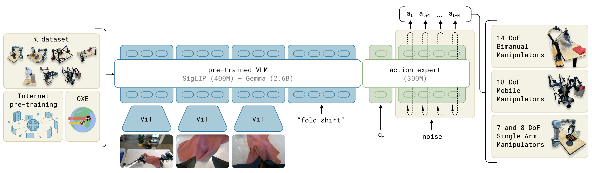
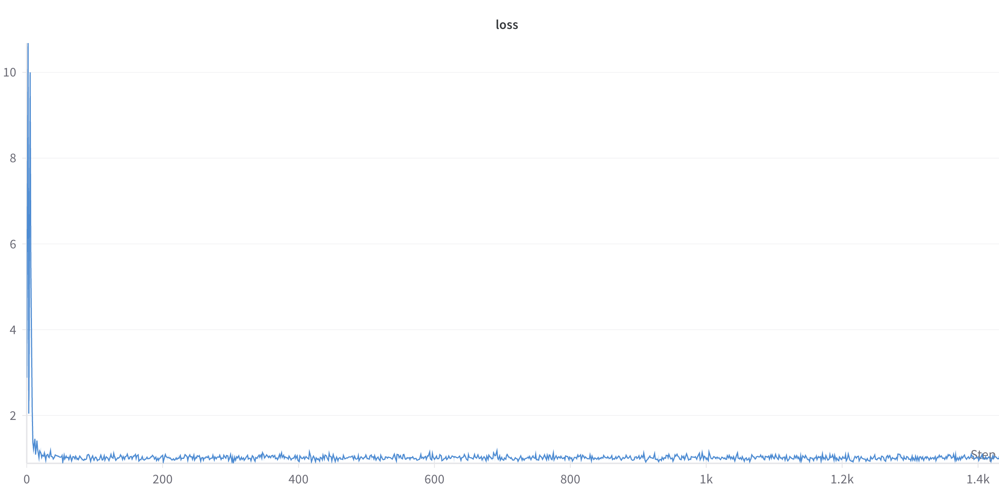

# Design Overview
I decided to prioritize the following goals:
- Develop a Mixture of Experts block that can robustly accomodate many action generation formulations
- Implement a basic version of pi_zero with flow matching loss
- Train a small policy on a small push-T behavioral cloning dataset
- Implement the module for a combined flow matching and autoregressive action prediction policy
- Implement unit tests if time allows

After completing the above, I'd like to provide an overview of this codebase and discuss the pro's and con's of design decisions I have made.

### Repository Structure
```
/pi_zero_project
  ├── model/
  │   ├── components/
  │   │   └── attention.py, moe_transformer_block.py, etc.
  │   ├── vlm/
  │   │   └── img_model/
  │   │   └── llm_model/ (can be removed)
  │   └── policy/
  │   │   └── ...
  ├── training/
  │   ├── data_utils/
  │   │   └── jax_dataloader.py
  │   │   └── ...
  │   ├── objectives/
  │   │   └── ...
  │   └── train.py, etc.
  ├── utils/
  │   └── model_visualization.py, etc.
  └── tests/
```

I started off by porting over the ViT, Gemma, and PaliGemma code from Google's [Big Vision repository](https://github.com/google-research/big_vision). While I refactored much of it, there still exist remnants of the original experimentation that I did from the Big Vision codebase.

### Overview of the Pi_Zero Implementation
The model is defined in `model/policy/pi_zero.py`. 

The `__call__` function of the `PiZero` module has the following arguments:
- `images`: (batch_size, num_images, height, width, 3)
- `text`: (batch_size, num_text_tokens)
- `proprio`: (batch_size, num_proprio_states, num_proprio_features)
- `action`: (batch_size, num_actions, num_action_features)
- `timesteps`: (batch_size,)

And it returns a (batch_size, num_actions, num_action_features) prediction and a dictionary of intermediate values. During execution, it begins by embedding all input modalities before performing a joint attention operation. Following the paper, different tokens are handled by different experts, and a custom mask is used to ensure blockwise causal attention accross the image + text, proprioceptive, and action modalities. 



Additionally, flow matching loss is implemented in `training/objectives/flow_matching_action.py`. Most of the code is well documented and should hopefully be easy to parse.


### Mixture of Experts Implementation
Most of the mixture of experts logic occurs in the `MoEAttention` class, which is defined in `model/components/attention.py`. Essentially, the model performs attention with the following mask:

```
--gemma-- --action expert--
img + txt    prop   act   ]
[i, i, t, t, p, p, a, a, a]

[1, 1, 1, 1, 0, 0, 0, 0, 0]
[1, 1, 1, 1, 0, 0, 0, 0, 0]
[1, 1, 1, 1, 0, 0, 0, 0, 0]
[1, 1, 1, 1, 0, 0, 0, 0, 0]
[1, 1, 1, 1, 1, 1, 0, 0, 0]
[1, 1, 1, 1, 1, 1, 0, 0, 0]
[1, 1, 1, 1, 1, 1, 1, 1, 1]
[1, 1, 1, 1, 1, 1, 1, 1, 1]
[1, 1, 1, 1, 1, 1, 1, 1, 1]
```

When designing the model, I was primarily deciding between two implementation options:
1. Run PaliGemma first while caching the KV values before running the attention expert using the cached values.
2. Calculate QKV for each expert at each layer before concatenating and running a single attention operation.

While the first option allows us to easily reuse PaliGemma, it loses the ability to run the attention operation in parallel, the cache eats memory during training, and it's harder to adapt to new action generation formulations.

The second option (which is implemented in the codebase) is more flexible and allows us to run the attention operation in parallel. If designed well, it also allows us to mix and match experts accross many attention mask formulations.

### Training on Push-T
In order to train on the `Push-T` dataset, I wrote a naive wrapper around the LeRobot 2.0 dataset class. I chose `Push-T` becuase I thought it'd provide a simple validation of the model, and I used LeRobot because it provides a pretty seemless way to load small robotics datasets. This is defined in `training/data_utils/jax_lerobot_dataset.py`. I also implemented a simple `train.py` script that can be used to train the model.

The model is currently being trained on the `Push-T` dataset. The loss curve so far is shown below:


The initial drop seems dubiously steep, and I'd have to continue to tune / debug the model as I validate performance in simulation.

# Additional Questions
### Autoregressive Action Prediction
If we wanted to implement OpenVLA-style autoregressive action prediction in addition to flow matching, we could do so by generating the autoregressive tokens after the flow matching tokens while masking out the flow matching tokens.

This would require a new attention mask that looks like the following:

```
--gemma-- --action expert-- --gemma--
img + txt    prop  flow act  auto act
[i, i, t, t, p, p, a, a, a, r, r, r, ...]

[1, 1, 1, 1, 0, 0, 0, 0, 0, 0, 0, 0, ...]
[1, 1, 1, 1, 0, 0, 0, 0, 0, 0, 0, 0, ...]
[1, 1, 1, 1, 0, 0, 0, 0, 0, 0, 0, 0, ...]
[1, 1, 1, 1, 0, 0, 0, 0, 0, 0, 0, 0, ...]
[1, 1, 1, 1, 1, 1, 0, 0, 0, 0, 0, 0, ...]
[1, 1, 1, 1, 1, 1, 0, 0, 0, 0, 0, 0, ...]
[1, 1, 1, 1, 1, 1, 1, 1, 1, 0, 0, 0, ...]
[1, 1, 1, 1, 1, 1, 1, 1, 1, 0, 0, 0, ...]
[1, 1, 1, 1, 1, 1, 1, 1, 1, 0, 0, 0, ...]
[1, 1, 1, 1, 1, 1, 0, 0, 0, 1, 0, 0, ...]
[1, 1, 1, 1, 1, 1, 0, 0, 0, 1, 1, 0, ...]
[1, 1, 1, 1, 1, 1, 0, 0, 0, 1, 1, 1, ...]
```

Because of how I designed `MoEAttention`, this architecture is easy to implement. I've implemented it in `model/policy/flow_autoreg_policy.py` in a way that reuses Gemma for the autoregressive tokens, similar to how OpenVLA reuses Prismatic for learning action tokens.

In addition, we could use the standard cross entropy loss for the autoregressive tokens. During training, we could employ teacher forcing and thus fully utilize parallelization accross all elements of the model. 

However, there are many additional ways we could implement the simulaneous autoregressive & flow-based action prediction, and I'll roughly outline the pros and cons of each.

1. Run the attention operation twice, once for the flow matching tokens and once for the autoregressive tokens.
    - This is easy to implement but doesn't fully utilize parallelization + would likely cause headaches during training. Note that during inference, we probably would want to run the flow matching and autoregressive tokens in separate processes simultaneously.
2. Same as the approach I outlined first except condition the autoregressive tokens on the flow matching tokens (or vice versa).
    - My intuition is that this would cause one methodology to dominate the other. Additionally, it'd prevent us from decoupling the flow matching and autoregressive tokens during inference.

### Goal Image Conditioning
Architectually, it'd likely be simplest to concatenate the goal image's ViT embedding to one of the image tokens and process it through a shared set of weights. Other options include conditioning via additive embeddings or during the encoding process, however these would likely be more difficult to get to train well.

However, there are some things to consider, particularly on the data front. For one, presumably we want the model to still learn good representations from its other inputs and not solely rely on the goal image. This formulation can be analogized to the style transfer problem, where the goal is effectively the style provided in context to the model.
- A goal should not be too simple such that the robot can ignore its other inputs to produce a successful output.
- We need to ensure no trivial (or spurious) correlations exist between the goal image and the robot's trajectory, as that'd prevent the model from learning informative representations.
- There should ideally be diversity in the goal images, such that the model doesn't learn an overly specific mapping between the goal image and actions.

### Design Considerations

In terms of development philosophy, I think it's important to prioritize the ability for researchers to quickly and modularly explore new ideas while enforcing hard constraints on all other axes. For instance, I think it's fair to force all models to inherit from a shared base class and to assume a consistent data format (e.g. always pass in the batch dimension first, etc.).

To ensure modularity and clean code, I think it's important to begin with an extensive and easily extensible set of shared model components and utilities such that code doesn't end up being unintentionally duplicated across the codebase. Additionally, training objectives should be written in a modular way such that a model can incorporate new objectives without having to entirely couple to the model's architecture.

A particularly thorny engineering challenge is the data loader, as it needs to support a variety of datasets collected from different robots and environments while running efficiently in a distributed training setup. As such, I'd start by gaining consensus on a data format, whether to include history or not, etc. because that influences how the data should be stored (e.g. store in sequential episodes, in a single array, cluster by robot, etc.). As the scale of data grows, it becomes increasingly difficult to fix broken elements of the data pipeline.

In terms of maintaining research productivity, I think having a unified experiment configuration, tracking system, and job execution system is critical. Along those lines, I think it's important to have a robust checkpointing system where researchers and engineers can easily load and continue training accross compute nodes and jobs.

Finally, building a standard evaluation pipeline is critical to minimize the time to signal for experiments. This could include a set of simulation environments as well as real-world rollouts for particularly promising experiments.
