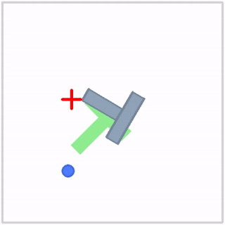

# Design Overview
Robax is a Python package for training modern robotics models in JAX.



*Example $\pi_{0}$ policy trained on the Push T task.*

### Repository Structure
```
/robax
  ├── model/
  │   ├── components/
  │   │   └── attention.py, moe_transformer_block.py, etc.
  │   ├── img_model/
  │   │   └── base_img_model.py, etc.
  │   └── policy/
  │   │   └── base_policy.py, pi_zero.py, mlp_policy.py, etc.
  ├── objectives/
  │   └── base_train_step.py, base_inference_step.py
  │   └── flow_matching.py, diffusion.py, mse.py, etc.
  ├── training/
  │   ├── data_utils/
  │   │   └── dataloader.py, etc.
  │   └── train.py, etc.
  ├── evaluation/
  │   └── envs/
  │   │   └── base_env.py, batched_env.py, pusht_keypoints_env.py, etc.
  │   └── action_buffer.py, observation_buffer.py, batch_evaluation.py, etc.
  ├── config/
  │   └── base_training_config.py
  │   └── example/
  │   │   └── pi_zero_flow.yaml, etc.
  ├── utils/
  │   └── model_utils.py, model_visualization.py, etc.
  └── tests/ (WIP)
```
